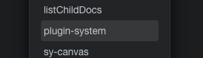

# 插件系统集市版 Plugin System Bazzar version.

## 使用方法 Usage

下载此挂件后，在任意文档中通过插入plugin-system挂件，等待程序运行成功后，重新启动思源，即可再右上角看到插件系统按钮。

Download the widget. Add the widget by 'plugin-system' to use. Wait for program inject success. Reload the SiYuan.

## 预览 Preview

